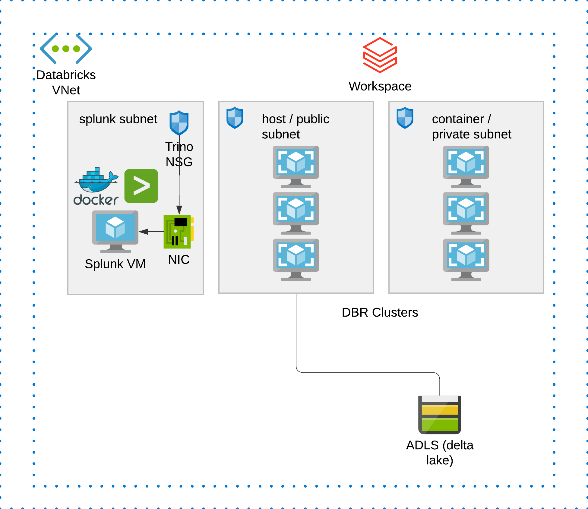

# Splunk-Databricks integration pattern and quick setup

This is an automated tf template to deploy Databricks workspace and a VM hosting Splunk, and integrate them. 
This is a collaborative work with jerrold.law@databricks.com, with effort to automate the setup process.

### Overall Architecture:

`Context`:

Source from repo:
https://github.com/databrickslabs/splunk-integration

Quote: *The Databricks add-on for Splunk, an app, that allows Splunk Enterprise and Splunk Cloud users to run queries and execute actions, such as running notebooks and jobs, in Databricks.*

You can use this splunk-integration app to connect Databricks clusters with Splunk instance(s). This integration is bi-directional and you can query Splunk from Databricks, and also query Databricks Delta tables from splunk.

What you can do using this integration app?

1. Run Databricks SQL queries right from the Splunk search bar and see the results in Splunk UI (Fig 1 )
2. Execute actions in Databricks, such as notebook runs and jobs, from Splunk (Fig 2 & Fig 3)
3. Use Splunk SQL database extension to integrate Databricks information with Splunk queries and reports (Fig 4 & Fig 5)
4. Push events, summary, alerts to Splunk from Databricks (Fig 6 and Fig 7)
5. Pull events, alerts data from Splunk into Databricks (Fig 8)

### Getting started

Step 1: Clone this repo to your local, `git clone xxx`. Make sure you have installed Terraform on your machine.

Step 2: Navigate to this folder `/adb-splunk`, run `terraform init` and `terraform apply` then yes. This will deploy the infra to your Azure subscription.

Step 3: There will be an output id address, use that to replace the ip in http://20.212.33.56:8000, then login using default username and password:
`admin` and `password`, this brings you to the Splunk VM landing page. 
