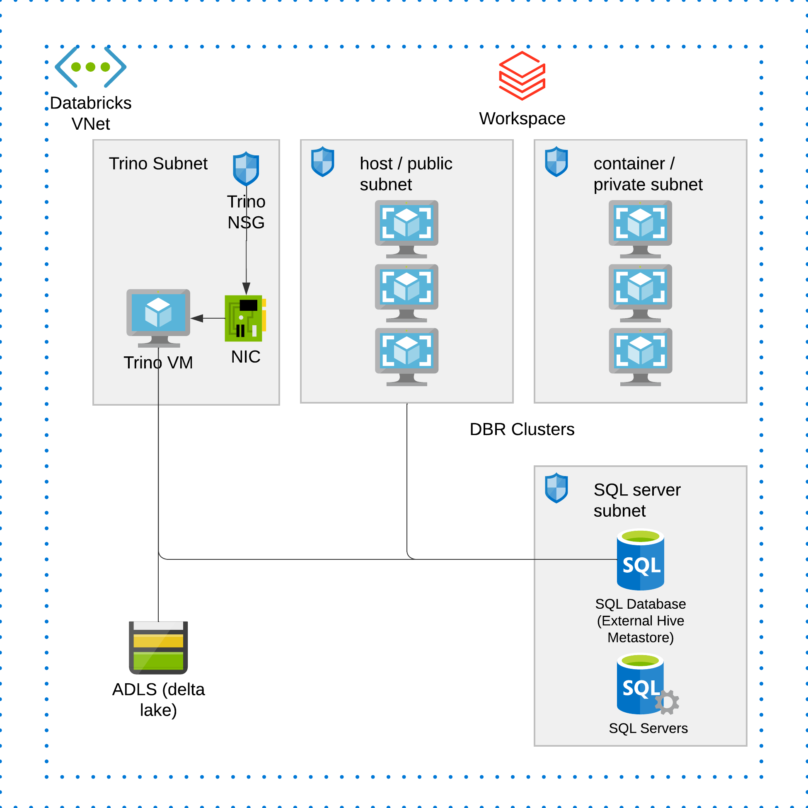

## Objective
1. Use packer to create azure image that have pre-installed Trino (previously prestosql) and configured to connect to Delta tables on ADLS Gen2, delta tables are created from Azure Databricks.
2. Use terraform to create vm as Trino vm instance, for testing and POC purposes, we only use 1 vm for Trino.
3. Deploy Azure Databricks Workspace and one notebook to create delta table on ADLS for Trino to query.
4. You need to use External Hive Metastore for your databricks cluster.

## Credits

Credits to Max (Wenjun.Zhou@microsoft.com) for creating the original solution and setting up trino-delta connector and Bowei (Bowei.Feng@microsoft.com) for efforts in overall solutioning.

## Overall Architecture:

Narratives: Databricks workspace is deployed into a VNet, the VNet has 4 subnets: 2 for databricks, 1 for sql server (external metastore), 1 for Trino vm. We use Databricks to create external tables and put data on ADLS, and configure Trino to use delta connector to read delta tables.

## Execution Steps:
### Step 1:

This step creates an `empty` resource group for hosting custom-built image and a local file of config variables in `/packer/os`.

Redirect to `/packer/tf_coldstart`, run:
   1. `terraform init`
   2. `terraform apply`

### Step 2:

This step you will use packer to build the actual trino image. Packer will read the auto-generated `*.auto.pkrvars.hcl` file and build the image. The image will have preconfigured to use Delta Connector.

Redirect to `/packer/os`, run:
   1. `packer build .`
   
### Step 3:

This step creates all the other infra for this project, specified in `/main`.

Redirect to `/main`, run:
   1. `terraform init`
   2. `terraform apply`

Now in folder of `/main`, you can find the auto-generated private key for ssh, to ssh into the provisioned vm, run:
`ssh -i ./ssh_private.pem azureuser@52.230.84.169`, change to the public ip of the trino vm accordingly. Check the nsg rules of the trino vm, we have inbound rule 300 allowing any source for ssh, this is for testing purpose only! Once you ssh into trino vm, vi /etc/squid/squid.conf and you will find similar content like:

The content was auto inserted by packer in step 2.

### Step 4:

Open your databricks workspace, you will find a notebook been created in `Shared/` folder, this is the notebook to create a managed table but data stored on ADLS.
A small vanilla cluster has been created to run this notebook and create dummy database and table.

## Conclusion

We used a single instance of squid proxy server to control granular outbound traffic from Databricks clusters. You can use cluster proxy to enforce the init script, such that all clusters will abide to the init script config and go through the proxy.

## FAQ:

1. General Packer Token expired issue. Packer shows error: Status code 400, AADSTS700082 The refresh token has expired due to inactivity.
Solution -> packer usually stores token in user/.azure/packer, remove the tokens in that hidden folder and return to your packer project, do packer init and packer build again should resolve the issue.

